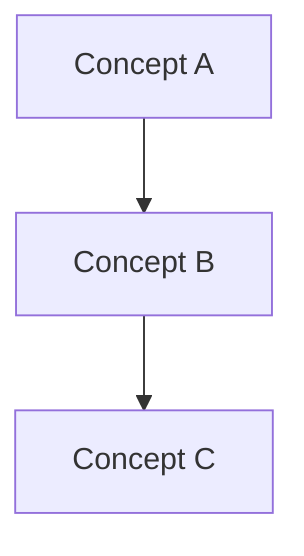

The user invoked `/guide` with this request:

`$ARGUMENTS`

Create a practical, step-by-step guide for the topic and context the user provides. Write the final Markdown file under `docs/` with a descriptive filename matching `guide_*.md`.

Workflow:
- Clarify only what is essential. If the user gives no usable topic, audience, or target environment, ask one short question. Otherwise proceed with reasonable assumptions and mention them briefly.
- Inspect existing files in `docs/` before writing. Match useful repository conventions such as heading style, code fence languages, table formatting, and level of detail.
- Choose a final path in the form `docs/guide_<descriptive_slug>.md`. Use lowercase words separated by underscores. Avoid vague slugs such as `guide_notes.md`, and do not overwrite an existing file unless the user asked to update it.
- Keep temporary drafts, generated examples, or evaluation artifacts outside `docs/`; `docs/` should contain final guide files only.
- Write a self-contained guide that helps a real reader complete or understand the topic. Include a title, purpose sentence, prerequisites or assumptions, step-by-step sections, concrete examples, verification checks, troubleshooting when useful, and a quick reference or next steps section.
- Include concrete examples that fit the topic. Prefer runnable commands, realistic snippets, before/after examples, or small config files over generic prose.
- Include Mermaid diagrams when they clarify relationships, architecture, state, sequence, data flow, or decision flow. Use fenced Mermaid blocks only.
- For procedural guides, make each step answer what to do, why it matters, and what success looks like.
- For conceptual guides, include a mental model, core concepts, worked example, diagram, and practice prompts or exercises when useful.
- After writing, read back enough of the file to catch broken heading order, unclosed code fences, missing examples, non-Mermaid diagrams, and filename mistakes.
- Report the final path and summarize the guide's scope in one or two sentences.

Prefer this shape for procedural topics:

```markdown
# [Topic] Guide

[Purpose sentence.]

## Prerequisites

## Table of Contents

## Step 1: [Outcome]

### Example

### Verify

## Step 2: [Outcome]

## Troubleshooting

## Quick Reference
```

Prefer this shape for conceptual topics:

````markdown
# [Topic] Guide

[Purpose sentence.]

## Mental Model

## Core Concepts

## Worked Example

## Mermaid Graph



## Practice Prompts or Exercises

## Quick Reference
````

Filename examples:
- Topic: "Docker Compose for Phoenix and Postgres" -> `docs/guide_docker_compose_phoenix_postgres.md`
- Topic: "OAuth PKCE flow" -> `docs/guide_oauth_pkce_flow.md`
- Topic: "tmux panes and sessions" -> `docs/guide_tmux_panes_sessions.md`

Notes:
- If the user explicitly names a target file, use it only when it lives under `docs/` and starts with `guide_`; otherwise explain the convention and choose a compliant path.
- If the topic depends on uncertain facts, mark assumptions or ask before writing when guessing would mislead the reader.
- If updating an existing guide, preserve useful content and improve structure, examples, Mermaid graphs, verification, and troubleshooting rather than rewriting for its own sake.
