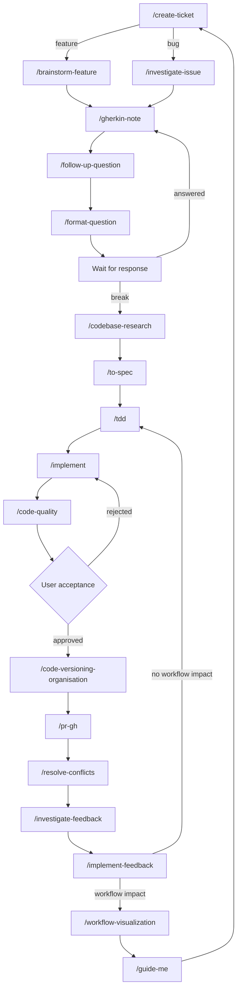

# Guide Me

Orient the user in the feature workflow by reading `_workflow.md` and the note chain in `_woj/`, then answer conversationally: where they are, what the next `/command` is per the workflow edges, and anything missing or blocking. The orientation is recorded in a handoff note under `_woj/14-guide-me/` so the session state survives on disk.

## When to use

- The user invokes `/guide-me`.
- The user asks "where are we", "what's next", "what step comes next", "guide me through the workflow", "what should I do now", or any orientation question about the workflow.
- The user wants to resume work after a pause (e.g. "we were working on the X feature, where did we leave off").

## Workflow

### 1. Read the workflow map

- Read `_workflow.md` at the repo root to get the commands and their edges:

- Note the two back-edges that re-enter the chain (`F -->|answered| B`, `S -->|rejected| I`) — they matter when determining the next step.

### 2. Inspect the chain state in `_woj/`

- List `_woj/` subdirectories. The note chain lives in these directories (in chain order): `00-tickets` (create-ticket), `00-issues` (investigate-issue), `01-gherkin-note` (gherkin-note), `02-architecture` (codebase-research), `03-follow-up-questions` (follow-up-question), `04-format-question` (format-question), `05-spec` (to-spec), `06-tdd` (tdd), `07-implement` (implement), `08-code-quality` (code-quality), `09-code-versioning` (code-versioning-organisation), `10-pr` (pr-gh), `11-feedback` (investigate-feedback), `12-implement-feedback` (implement-feedback), `13-workflow-visualization` (workflow-visualization), `14-guide-me` (guide-me). Directories that were never used simply do not exist.
- For each directory, find the note with the highest `NNN-` prefix (the most recent one).
- Read the latest notes lightly — the first ~20 lines is enough — to see their state:
  - **Verdicts:** look for markers like `changes-requested` vs `approve` in code-quality notes; a rejected verdict means the user re-enters `/implement`.
  - **Open questions:** empty `## Open questions` sections mean the note is unblocked; unresolved items mean the next step is `/follow-up-question` (or `/format-question` to send the questionnaire).
  - **Answered questionnaires:** a `## Conclusions` section in a gherkin-note or architecture note means the wait-for-response step resolved and the chain may proceed.
  - **Routes:** the `## Route` section of a `_woj/12-implement-feedback/` note records whether the chain goes to `/workflow-visualization` or `/code-quality`.

### 3. Determine the current stage

- Walk the chain from the start: which steps are complete (note exists, no open blockers), which are in flight (note exists with unresolved items), and which are missing.
- Identify what is blocking or missing: an unanswered `## Open questions` list, a `changes-requested` verdict, unaddressed feedback items in `_woj/11-feedback/`, an unapproved code-quality note, or the absence of the expected note in the next directory.
- The next step is the node reachable from the current stage in `_workflow.md`. When the current stage is mid-cycle (e.g. a verdict or wait-for-response state), the edge decides: `changes-requested` → `/implement`; `approve` → `/code-versioning-organisation`; answered questionnaire → back to the owning skill.

### 4. Check `git status` for in-flight implementation work

- Run `git status` (and, if useful, `git log --oneline -5` and the branch name) to detect:
  - **Uncommitted changes** — implementation is mid-flight; the next step is finishing `/implement` or `/code-quality`, not starting a new cycle.
  - **An unpushed branch or open PR branch** — the chain is at `/pr-gh` or later (e.g. `/resolve-conflicts`, `/investigate-feedback`).
  - **A clean tree on the default branch** — the previous cycle completed; the next step is a fresh `/create-ticket` (or wherever the chain's last note points).

### 5. Write the handoff note

Write to `_woj/14-guide-me/NNN-<slug>.md` where:

- `NNN` and `<slug>` **mirror the current feature's basename** when a feature chain exists — take the highest `NNN-` prefix present across the chain directories (`00-tickets` through `13-workflow-visualization`) and use its `NNN-<slug>` (e.g. a chain around `002-setup-logging.md` produces `_woj/14-guide-me/002-setup-logging.md`), keeping the session traceable to the feature.
- When no chain exists, scan `_woj/14-guide-me/*.md` for the highest existing `NNN-` prefix, add 1, and zero-pad to 3 digits (start at `001` if empty). Use the slug `workflow-status`.

Create `_woj/14-guide-me/` if it does not exist. Never overwrite an existing file — if a note with that basename already exists, append a new `## Session <n>` section (continuing the numbering) with the new orientation, preserving the earlier content.

Note template:

    # <Feature title or Workflow Status> — Session Guide

    ## Source

    - Workflow map: `_workflow.md`
    - Chain notes: <paths of the latest note per directory, or "none">

    ## Current stage

    <where the user is in the workflow>

    ## Next step

    <the next `/command` per the `_workflow.md` edges>

    ## Blockers

    - <anything missing, unresolved, or blocking>

    ## Notes

    - <git status findings and other context>

Drop `## Blockers` or `## Notes` only when they add nothing.

### 6. Answer conversationally

- Keep the answer SHORT — a few lines: where the user is, what the next `/command` is (per the `_workflow.md` edges), and anything missing or blocking.
- When the state is ambiguous (two or more plausible continuations, e.g. a note with unresolved open questions but also a `changes-requested` verdict), offer the two or three plausible next steps with a recommendation.

## Verify before finishing

- Re-read the handoff note and confirm the filename followed the `NNN-<slug>.md` rule (mirrored feature basename, or next sequence + `workflow-status`).
- Confirm `## Current stage`, `## Next step`, and any `## Blockers` reflect the actual state of the chain and `git status` just inspected.
- Confirm no existing note was overwritten.

## Reporting back

Answer the user conversationally (a few lines): the current stage, the next `/command`, and any blockers or missing pieces. Tell them the handoff note path where the orientation was recorded.
