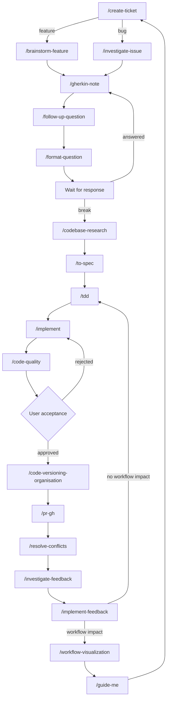

```mermaid
flowchart TD
    T["/create-ticket"] -->|feature| A["/brainstorm-feature"]
    T -->|bug| P["/investigate-issue"]
    A --> B["/gherkin-note"]
    P --> B
    B --> D["/follow-up-question"]
    D --> E["/format-question"]
    E --> F[Wait for response]
    F -->|answered| B
    F -->|break| C["/codebase-research"]
    C --> G["/to-spec"]
    G --> H["/tdd"]
    H --> I["/implement"]
    I --> J["/code-quality"]
    J --> S{User acceptance}
    S -->|rejected| I
    S -->|approved| L["/code-versioning-organisation"]
    L --> M["/pr-gh"]
    M --> Q["/resolve-conflicts"]
    Q --> N["/investigate-feedback"]
    N --> O["/implement-feedback"]
    O -->|workflow impact| K["/workflow-visualization"]
    O -->|no workflow impact| H
    K --> R["/guide-me"]
    R --> T
```
