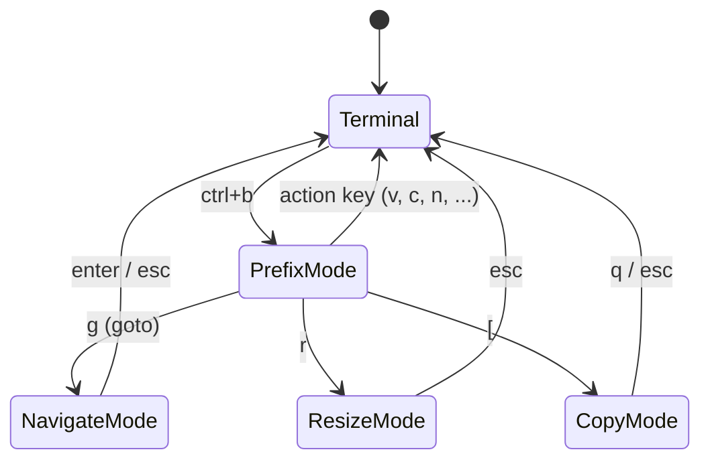

# Herdr Keyboard Shortcuts Guide

A complete keyboard reference for Herdr (terminal agent multiplexer, [herdr.dev](https://herdr.dev)) — from the prefix key to copy mode, custom bindings, and prefix-free chords. Written against Herdr **0.8.0**.

---

## Table of Contents

1. [Prerequisites](#prerequisites)
2. [Core Concepts](#core-concepts)
3. [The Prefix Key](#the-prefix-key)
4. [Getting Help In-App](#getting-help-in-app)
5. [Panes](#panes)
6. [Tabs](#tabs)
7. [Workspaces & Worktrees](#workspaces--worktrees)
8. [Navigate Mode (Goto)](#navigate-mode-goto)
9. [Copy Mode & Scrollback](#copy-mode--scrollback)
10. [Agents, Notifications & Session Control](#agents-notifications--session-control)
11. [Customizing Keybindings](#customizing-keybindings)
12. [Quick Reference](#quick-reference)
13. [Troubleshooting](#troubleshooting)
14. [Next Steps](#next-steps)

---

## Prerequisites

- Herdr installed — run the automated installer from this repository:

  ```zsh
  chmod +x herdr.zsh
  ./herdr.zsh
  ```

  It installs Herdr via Homebrew, seeds `~/.config/herdr/config.toml`, and offers to install integrations for the coding-agent CLIs it detects (Claude Code, Codex, Cursor, OpenCode, ...).

- A running Herdr session: `herdr` (attaches, starting the server if needed) or `brew services start herdr` for a background server.

**Keyboard is optional.** Herdr is fully mouse-drivable — click panes, drag borders, split and switch from right-click menus. This guide is for when you want to keep your hands on the keyboard.

---

## Core Concepts

Herdr organizes work in three levels, like tmux:

| Level     | What it is                             | Analogy             |
|-----------|----------------------------------------|---------------------|
| Workspace | A project (has its own working dir)    | A tmux session      |
| Tab       | A screen inside a workspace            | A tmux window       |
| Pane      | An individual terminal (or agent)      | A tmux pane         |

Keyboard interaction happens in **modes**. You are normally typing into your terminal; the prefix key opens a window where the *next* keypress goes to Herdr instead:



---

## The Prefix Key

Every Herdr action starts with the **prefix**: press `ctrl+b`, release, then press the action key. `prefix+v` below always means "press `ctrl+b`, then `v`".

Change the prefix in `~/.config/herdr/config.toml`:

```toml
[keys]
prefix = "ctrl+b"   # examples: "ctrl+a", "f12", "esc", "-"
```

Apply it without restarting:

```zsh
herdr server reload-config
```

You can also reload from inside Herdr with `prefix+shift+r`.

### Verify

Press `prefix+?` — the keybinding help overlay should open and show your prefix on every binding.

---

## Getting Help In-App

| Action                                | Keys        |
|---------------------------------------|-------------|
| Show all active keybindings (overlay) | `prefix+?`  |
| Filter the list                       | `/`         |
| Clear the filter                      | `ctrl+u`    |
| Open settings                         | `prefix+s`  |

`prefix+?` is the authoritative list for *your* config — when in doubt, trust it over any document (including this one).

---

## Panes

Panes are where your shells and agents live. Splits, movement, and lifecycle:

| Action                    | Keys                      |
|---------------------------|---------------------------|
| Split right (vertical)    | `prefix+v`                |
| Split down (horizontal)   | `prefix+minus` (`-`)      |
| Focus pane left/down/up/right | `prefix+h` / `j` / `k` / `l` |
| Cycle to next pane        | `prefix+tab`              |
| Cycle to previous pane    | `prefix+shift+tab`        |
| Swap pane left/down/up/right | `prefix+shift+h` / `j` / `k` / `l` |
| Zoom (fullscreen) focused pane | `prefix+z`           |
| Close pane                | `prefix+x`                |
| Rename pane               | `prefix+shift+p`          |
| Enter resize mode         | `prefix+r`                |

Notes:

- **Zoom** toggles: `prefix+z` again restores the layout.
- **Resize mode** (`prefix+r`) is modal — adjust the focused pane's borders, then leave the mode. Its inner keys are listed in the `prefix+?` overlay.
- `last_pane` (jump back and forth between two panes) exists but is **unbound by default**; see [Customizing Keybindings](#customizing-keybindings).

### Verify

`prefix+v` then `prefix+minus` should give you three panes; `prefix+h/j/k/l` moves the focus ring between them; `prefix+z` makes one fill the tab.

---

## Tabs

Tabs group panes inside a workspace:

| Action              | Keys               |
|---------------------|--------------------|
| New tab             | `prefix+c`         |
| Next tab            | `prefix+n`         |
| Previous tab        | `prefix+p`         |
| Jump to tab 1–9     | `prefix+1..9`      |
| Rename tab          | `prefix+shift+t`   |
| Close tab           | `prefix+shift+x`   |

---

## Workspaces & Worktrees

Workspaces are top-level projects; each has its own working directory. Herdr can also create **git worktrees** so agents work on isolated copies of a repo:

| Action                          | Keys               |
|---------------------------------|--------------------|
| Workspace picker                | `prefix+w`         |
| Goto picker (navigate mode)     | `prefix+g`         |
| New workspace                   | `prefix+shift+n`   |
| New git worktree                | `prefix+shift+g`   |
| Rename workspace                | `prefix+shift+w`   |
| Close workspace                 | `prefix+shift+d`   |
| Toggle sidebar                  | `prefix+b`         |

Unbound by default (available to map yourself): `previous_workspace`, `next_workspace`, `switch_workspace` (indexed `prefix+shift+1..9` style), `open_worktree`, `remove_worktree`.

---

## Navigate Mode (Goto)

`prefix+g` opens the goto picker — a modal navigate mode for jumping anywhere with plain keys (no prefix needed while it is open):

| Action                       | Keys (inside navigate mode) |
|------------------------------|------------------------------|
| Move up/down the workspace list | `up` / `down` (or `k` / `j` via config) |
| Focus pane left/down/up/right   | `h` / `j` / `k` / `l`     |
| Focus pane left/right (always)  | `left` / `right` arrows   |
| Confirm / leave                 | `enter` / `esc`           |

Navigate-mode keys are configured separately from the `prefix+` bindings (`navigate_*` options) and win over terminal input only while the picker is open. They must be plain keys — `prefix+`, `esc`, `enter`, `tab`, and unmodified `1..9` cannot be remapped here.

---

## Copy Mode & Scrollback

Enter copy mode with `prefix+[` to scroll, search, and copy with the keyboard (vim-style):

| Action                    | Keys                                   |
|---------------------------|----------------------------------------|
| Move                      | `h` / `j` / `k` / `l`                  |
| Word forward / back / end | `w` / `b` / `e`                        |
| Paragraph up / down       | `{` / `}`                              |
| Page up / down            | `PageUp` / `PageDown`, `ctrl+b` / `ctrl+f` |
| Half-page up / down       | `ctrl+u` / `ctrl+d`                    |
| Search forward / backward | `/` / `?`                              |
| Next / previous match     | `n` / `N`                              |
| Start selection           | `v` or `Space`                         |
| Copy selection            | `y` or `Enter`                         |
| Exit copy mode            | `q` or `Esc`                           |

Related:

| Action                                   | Keys        |
|-------------------------------------------|-------------|
| Edit scrollback (open history in editor)  | `prefix+e`  |
| Paste image into a remote session         | `ctrl+v` (only in `herdr --remote`) |

---

## Agents, Notifications & Session Control

Herdr auto-detects coding agents (Claude Code, Codex, OpenCode, ...) running in panes and tracks their state (idle / working / blocked):

| Action                                    | Keys               |
|--------------------------------------------|--------------------|
| Open the pane that raised a notification   | `prefix+o`         |
| Detach from the session (keeps running)    | `prefix+q`         |
| Reload config                              | `prefix+shift+r`   |
| Open settings                              | `prefix+s`         |

Unbound by default (map them if you herd many agents): `previous_agent`, `next_agent`, `focus_agent` (indexed, e.g. `prefix+alt+1..9` to jump straight to agent N).

`ctrl+click` opens links in panes (OSC 8 hyperlinks and visible URLs) when mouse capture is enabled.

---

## Customizing Keybindings

All bindings live in `~/.config/herdr/config.toml` under `[keys]`. Two binding syntaxes exist:

- `"prefix+n"` — requires the prefix first.
- `"ctrl+alt+n"` — a **direct chord**: fires immediately, no prefix.

### Example: bind the unbound actions

```toml
[keys]
prefix = "ctrl+b"
last_pane = "prefix+backtick"        # jump between two panes
next_workspace = "prefix+shift+n"    # careful: default new_workspace uses this
previous_workspace = "prefix+shift+p"
focus_agent = "prefix+alt+1..9"      # jump straight to agent 1-9
```

Apply with `herdr server reload-config` (or `prefix+shift+r`), then confirm in `prefix+?`.

### Direct (prefix-free) chords

The `ctrl+alt` family is the most reliable across terminals:

```toml
[keys]
focus_pane_left  = "ctrl+alt+h"
focus_pane_down  = "ctrl+alt+j"
focus_pane_up    = "ctrl+alt+k"
focus_pane_right = "ctrl+alt+l"
next_tab         = "ctrl+alt+]"
previous_tab     = "ctrl+alt+["
new_tab          = "ctrl+alt+c"
zoom             = "ctrl+alt+z"
```

Avoid system-owned chords: `ctrl+alt` + arrows, `t`, `l`, `a`, `s`, `u`, and `f1`–`f12`. In general, `ctrl+letter`, function keys, and explicit modified chords are the most reliable; `alt+...`, `cmd`/`super`, and punctuation-with-modifiers depend on your terminal (and on tmux, if Herdr runs inside it).

### Custom commands on keys

Bind arbitrary commands to keys — three launch types:

```toml
[[keys.command]]
key = "prefix+alt+g"
type = "popup"        # session-modal terminal; layout untouched
command = "lazygit"
width = "80%"
height = "80%"

[[keys.command]]
key = "prefix+alt+t"
type = "pane"         # temporary zoomed pane, closes when the command exits
command = "just test"

[[keys.command]]
key = "prefix+alt+b"
type = "shell"        # runs detached in the background
command = "just build"
```

### Indexed shortcuts (legacy)

```toml
[keys.indexed]
tabs = "ctrl"         # ctrl+1..9 switches tabs directly
workspaces = "ctrl+shift"
agents = "alt"
```

Still parsed for compatibility — prefer `switch_tab`, `switch_workspace`, and `focus_agent` in new configs.

---

## Quick Reference

| Keys                    | Action                          |
|-------------------------|---------------------------------|
| `ctrl+b`                | Prefix (start every action)     |
| `prefix+?`              | Keybinding help overlay         |
| `prefix+v` / `prefix+-` | Split right / split down        |
| `prefix+h/j/k/l`        | Focus pane in direction         |
| `prefix+shift+h/j/k/l`  | Swap pane in direction          |
| `prefix+tab` / `prefix+shift+tab` | Cycle panes           |
| `prefix+z`              | Zoom pane (toggle)              |
| `prefix+x`              | Close pane                      |
| `prefix+r`              | Resize mode                     |
| `prefix+[`              | Copy mode (vim keys, `y` copies)|
| `prefix+e`              | Edit scrollback                 |
| `prefix+c`              | New tab                         |
| `prefix+n` / `prefix+p` | Next / previous tab             |
| `prefix+1..9`           | Jump to tab N                   |
| `prefix+shift+t` / `prefix+shift+x` | Rename / close tab  |
| `prefix+w`              | Workspace picker                |
| `prefix+g`              | Goto picker (navigate mode)     |
| `prefix+shift+n`        | New workspace                   |
| `prefix+shift+g`        | New git worktree                |
| `prefix+shift+w` / `prefix+shift+d` | Rename / close workspace |
| `prefix+b`              | Toggle sidebar                  |
| `prefix+o`              | Open notification target        |
| `prefix+s`              | Settings                        |
| `prefix+shift+r`        | Reload config                   |
| `prefix+q`              | Detach (session keeps running)  |
| `ctrl+click`            | Open link in pane               |

---

## Troubleshooting

**A shortcut does nothing.**
Check `prefix+?` first — it shows the bindings actually loaded. If your binding is missing, the config didn't load: run `herdr server reload-config` and watch for TOML errors.

**`alt+...` or `cmd+...` chords don't arrive.**
Many terminals swallow or remap these. Prefer the `ctrl+alt` family, `ctrl+letter`, or function keys. If Herdr runs inside tmux, tmux may consume the chord before Herdr sees it.

**`ctrl+b` conflicts with tmux.**
If you nest Herdr inside tmux (or vice versa), change one prefix, e.g. `prefix = "ctrl+a"` in Herdr's `[keys]`, then `herdr server reload-config`.

**Keys go to the terminal instead of Herdr.**
The prefix window applies to the *next* keypress only. Press the prefix again — or use the mouse; every keyboard action has a mouse equivalent.

**Changed the config but nothing happened.**
Reload is not automatic: `herdr server reload-config` from any shell, or `prefix+shift+r` from inside Herdr.

---

## Next Steps

- Run `./herdr.zsh` to install Herdr and set up agent integrations (this repo).
- Read `herdr agent --help` for scripting agents from the CLI (`herdr agent prompt`, `herdr agent wait`, ...).
- Official docs: [herdr.dev/docs/keyboard](https://herdr.dev/docs/keyboard/) and [herdr.dev/docs/configuration](https://herdr.dev/docs/configuration/).
