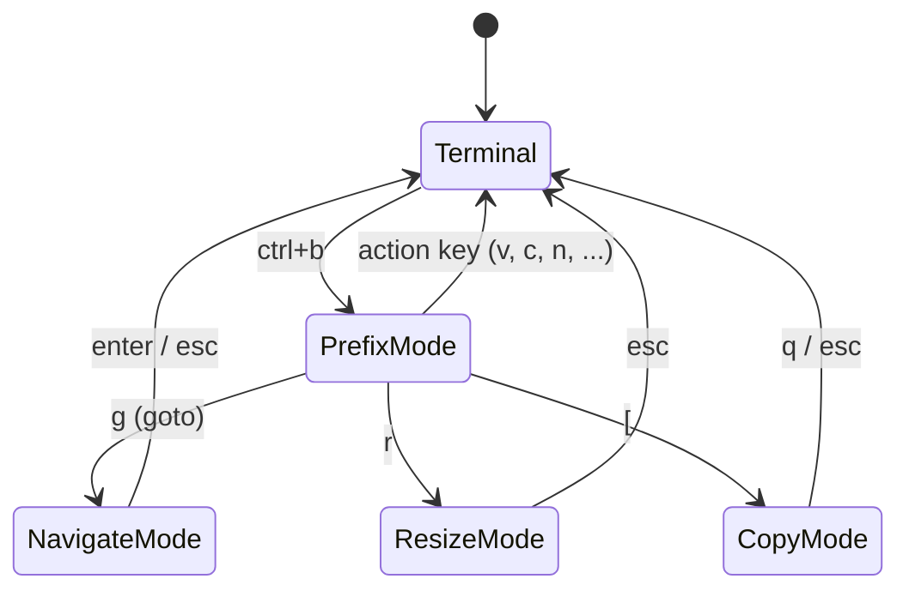

# Herdr Keyboard Shortcuts Guide

A complete keyboard reference for Herdr (terminal agent multiplexer, [herdr.dev](https://herdr.dev)) — from the prefix key to copy mode, custom bindings, and prefix-free chords. Written against Herdr **0.8.0**.

---

## Table of Contents

1. [What is Herdr?](#what-is-herdr)
2. [Installation](#installation)
3. [Core Concepts](#core-concepts)
4. [The Prefix Key](#the-prefix-key)
5. [Getting Help In-App](#getting-help-in-app)
6. [Panes](#panes)
7. [Tabs](#tabs)
8. [Workspaces & Worktrees](#workspaces--worktrees)
9. [Navigate Mode (Goto)](#navigate-mode-goto)
10. [Copy Mode & Scrollback](#copy-mode--scrollback)
11. [Agents, Notifications & Session Control](#agents-notifications--session-control)
12. [The Repo Config: Four-Tier Scheme](#the-repo-config-four-tier-scheme)
13. [Customizing Keybindings](#customizing-keybindings)
14. [Quick Reference](#quick-reference)
15. [Troubleshooting](#troubleshooting)
16. [Next Steps](#next-steps)

---

## What is Herdr?

**Herdr** is a terminal agent multiplexer. It organizes shells and coding-agent CLIs into persistent workspaces with panes, tabs, keyboard shortcuts, mouse controls, notifications, and git worktree support.

Think of it as tmux-style terminal layout management built for running multiple coding agents side by side.

**Why you need it:**

- Run OpenCode, Claude Code, Codex, shells, git tools, and status panes in one workspace
- Keep agent sessions organized by project, tab, and pane
- Jump to agents that need attention from notifications or sidebar shortcuts
- Create isolated git worktrees so agents can work in parallel
- Use either keyboard shortcuts or mouse controls for every core layout action

---

## Installation

Run the automated installer from this repository:

```zsh
chmod +x herdr.zsh
./herdr.zsh
```

The installer will:

1. **Install Herdr** via Homebrew
2. **Seed** `~/.config/herdr/config.toml`
3. **Offer integrations** for detected coding-agent CLIs such as Claude Code, Codex, Cursor, and OpenCode
4. **Prompt for optional developer plugins**
5. **Add project-specific helper bindings**, including the 3-tab command workspace shortcut described later

Start Herdr:

```zsh
herdr
```

Or run the server in the background:

```zsh
brew services start herdr
```

**Keyboard is optional.** Herdr is fully mouse-drivable — click panes, drag borders, split and switch from right-click menus. This guide is for when you want to keep your hands on the keyboard.

---

## Core Concepts

Herdr organizes work in three levels, like tmux:

| Level     | What it is                             | Analogy             |
|-----------|----------------------------------------|---------------------|
| Workspace | A project (has its own working dir)    | A tmux session      |
| Tab       | A screen inside a workspace            | A tmux window       |
| Pane      | An individual terminal (or agent)      | A tmux pane         |

Keyboard interaction happens in **modes**. You are normally typing into your terminal; the prefix key opens a window where the *next* keypress goes to Herdr instead:



---

## The Prefix Key

Every Herdr action starts with the **prefix**: press `ctrl+b`, release, then press the action key. `prefix+v` below always means "press `ctrl+b`, then `v`".

Change the prefix in `~/.config/herdr/config.toml`:

```toml
[keys]
prefix = "ctrl+b"   # examples: "ctrl+a", "f12", "esc", "-"
```

Apply it without restarting:

```zsh
herdr server reload-config
```

You can also reload from inside Herdr with `prefix+shift+r`.

### Verify

Press `prefix+?` — the keybinding help overlay should open and show your prefix on every binding.

---

## Getting Help In-App

| Action                                | Keys        |
|---------------------------------------|-------------|
| Show all active keybindings (overlay) | `prefix+?`  |
| Filter the list                       | `/`         |
| Clear the filter                      | `ctrl+u`    |
| Open settings                         | `prefix+s`  |

`prefix+?` is the authoritative list for *your* config — when in doubt, trust it over any document (including this one).

---

## Panes

Panes are where your shells and agents live. Splits, movement, and lifecycle:

| Action                    | Keys                      |
|---------------------------|---------------------------|
| Split right (vertical)    | `prefix+ctrl+v`           |
| Split down (horizontal)   | `prefix+ctrl+minus` (`-`) |
| Focus pane left/down/up/right | `prefix+ctrl+h` / `j` / `k` / `l` |
| Cycle to next pane        | `prefix+tab`              |
| Cycle to previous pane    | `prefix+shift+tab`        |
| Swap pane left/down/up/right | `prefix+ctrl+shift+h` / `j` / `k` / `l` |
| Zoom (fullscreen) focused pane | `prefix+ctrl+z`      |
| Close pane                | `prefix+ctrl+x`          |
| Rename pane               | `prefix+ctrl+r`          |
| Last pane (jump back and forth) | `prefix+ctrl+[`     |
| Enter resize mode         | `prefix+r`               |

Notes:

- **Zoom** toggles: `prefix+ctrl+z` again restores the layout.
- **Resize mode** (`prefix+r`) is modal — adjust the focused pane's borders, then leave the mode. Its inner keys are listed in the `prefix+?` overlay.
- `last_pane` (jump back and forth between two panes) is bound to `prefix+ctrl+[` — outside the range commonly used by agent TUIs.

### Verify

`prefix+ctrl+v` then `prefix+ctrl+minus` should give you three panes; `prefix+ctrl+h/j/k/l` moves the focus ring between them; `prefix+ctrl+z` makes one fill the tab.

---

## Tabs

Tabs group panes inside a workspace:

| Action              | Keys               |
|---------------------|--------------------|
| New tab             | `prefix+c`         |
| Next tab            | `prefix+n`         |
| Previous tab        | `prefix+shift+[`   |
| Jump to tab 1–9     | `prefix+1..9`      |
| Rename tab          | `prefix+shift+t`   |
| Close tab           | `prefix+shift+x`   |

Notes:

- `prefix+shift+[` must be delivered by your terminal as the base `[` key with a shift modifier (kitty keyboard protocol or CSI-u, e.g. Ghostty or modern iTerm2). Terminals that send the shifted character `{` instead cannot deliver this chord — if `prefix+shift+[` does nothing in `prefix+?` on your terminal, use the mouse or `prefix+w`, or remap `previous_tab`.

---

## Workspaces & Worktrees

Workspaces are top-level projects; each has its own working directory. Herdr can also create **git worktrees** so agents work on isolated copies of a repo:

| Action                          | Keys               |
|---------------------------------|--------------------|
| Workspace picker                | `prefix+w`         |
| Goto picker (navigate mode)     | `prefix+g`         |
| New workspace                   | `prefix+shift+n`   |
| Rename workspace                | `prefix+shift+w`   |
| Close workspace                 | `prefix+ctrl+shift+x` |
| Previous workspace              | `prefix+shift+h`   |
| Next workspace                  | `prefix+shift+l`   |
| Switch to workspace 1–9         | `prefix+shift+1..9`|
| Toggle sidebar                  | `prefix+b`         |

Worktree actions (`new_worktree`, `open_worktree`, `remove_worktree`) are intentionally left unbound in this repo — create worktrees from the sidebar instead.

To close the current workspace, press `prefix+ctrl+shift+x`, then confirm the prompt if `confirm_close` is enabled. This closes the workspace and its panes; use `prefix+ctrl+x` for only the focused pane, `prefix+shift+x` for only the current tab, and `prefix+q` when you only want to detach from Herdr while keeping the session running.

---

## Navigate Mode (Goto)

`prefix+g` opens the goto picker — a modal navigate mode for jumping anywhere with plain keys (no prefix needed while it is open):

| Action                       | Keys (inside navigate mode) |
|------------------------------|------------------------------|
| Move up/down the workspace list | `up` / `down` (or `k` / `j` via config) |
| Focus pane left/down/up/right   | `h` / `j` / `k` / `l`     |
| Focus pane left/right (always)  | `left` / `right` arrows   |
| Confirm / leave                 | `enter` / `esc`           |

Navigate-mode keys are configured separately from the `prefix+` bindings (`navigate_*` options) and win over terminal input only while the picker is open. They must be plain keys — `prefix+`, `esc`, `enter`, `tab`, and unmodified `1..9` cannot be remapped here.

---

## Copy Mode & Scrollback

Enter copy mode with `prefix+[` to scroll, search, and copy with the keyboard (vim-style):

| Action                    | Keys                                   |
|---------------------------|----------------------------------------|
| Move                      | `h` / `j` / `k` / `l`                  |
| Word forward / back / end | `w` / `b` / `e`                        |
| Paragraph up / down       | `{` / `}`                              |
| Page up / down            | `PageUp` / `PageDown`, `ctrl+b` / `ctrl+f` |
| Half-page up / down       | `ctrl+u` / `ctrl+d`                    |
| Search forward / backward | `/` / `?`                              |
| Next / previous match     | `n` / `N`                              |
| Start selection           | `v` or `Space`                         |
| Copy selection            | `y` or `Enter`                         |
| Exit copy mode            | `q` or `Esc`                           |

Related:

| Action                                   | Keys        |
|-------------------------------------------|-------------|
| Edit scrollback (open history in editor)  | `prefix+e`  |
| Paste image into a remote session         | `ctrl+v` (only in `herdr --remote`) |

---

## Agents, Notifications & Session Control

Herdr auto-detects coding agents (Claude Code, Codex, OpenCode, ...) running in panes and tracks their state (idle / working / blocked / done):

| Action                                    | Keys               |
|--------------------------------------------|--------------------|
| Open the pane that raised a notification   | `prefix+ctrl+shift+o` |
| Previous / next agent in sidebar           | `prefix+ctrl+shift+[` / `prefix+ctrl+shift+]` |
| Jump to agent 1-9                          | `prefix+ctrl+shift+1..9` |
| Create 3-tab command workspace             | `prefix+ctrl+w`    |
| Detach from the session (keeps running)    | `prefix+q`         |
| Reload config                              | `prefix+shift+r`   |
| Open settings                              | `prefix+s`         |

Agent navigation is unbound by Herdr defaults, but this setup maps `previous_agent`, `next_agent`, and indexed `focus_agent` with prefix-only shortcuts so they do not collide with agent TUIs such as OpenCode. `focus_agent` only accepts the literal `1..9` range — Herdr does not support narrowing it to fewer slots. `open_notification_target` is pinned explicitly to `prefix+ctrl+shift+o`, even though it deviates from Herdr's own `prefix+o` default — Herdr has no setting that focuses a pane automatically when a notification fires, so this manual follow-up keypress is the closest available equivalent to "auto-focus on notification."

In the agent tier, brackets mean previous/next (`[` = previous, `]` = next) and `o` opens the notification target, mirroring the pane tier's `prefix+ctrl+[` last-pane idiom.

There is no separate `agent_picker` action like `workspace_picker` (`prefix+w`) in Herdr 0.7/0.8. For picker-style navigation, use `prefix+g` to open the session navigator, then move through workspaces and panes. For agent-specific movement, use `prefix+ctrl+shift+[` / `prefix+ctrl+shift+]` to step through agents in the sidebar, `prefix+ctrl+shift+1..9` to jump directly to agent N, or `prefix+ctrl+shift+o` when a notification points at an agent that needs attention.

Each sidebar agent row shows its work status explicitly via `[ui.sidebar.agents]`, plus a native notification when something changes in the background. `agent_panel_sort = "spaces"` keeps agents grouped by workspace, in the same order as the spaces themselves, rather than sorting by priority — so agents don't shuffle position as their state changes:

```toml
[ui]
agent_panel_sort = "spaces"                     # group by workspace, in space order; no reshuffling on state change
show_agent_labels_on_pane_borders = true        # label each pane border with its detected agent kind

[ui.sidebar.agents]
rows = [["state_icon", "state_text", "workspace", "tab"], ["terminal_title_stripped"], ["agent"]]

[ui.sidebar.spaces]
rows = [["state_icon", "workspace"], ["branch", "git_status"]]  # mirror agent rows with per-workspace git state

[ui.toast]
delivery = "system"             # macOS notification when a background agent finishes or needs input
```

`state_icon` and `state_text` together spell out idle/working/blocked/done per agent instead of relying on the icon alone. `terminal_title_stripped` adds a 3rd row with the agent's live task/tool context, since most agent CLIs set their terminal title to reflect what they're currently doing. `rows` only nests two levels deep — each top-level entry is one stacked visual row of tokens, but a row's own elements cannot themselves be arrays (Herdr rejects that as an invalid sidebar token).

`[ui.sidebar.spaces]` applies the same idea to workspaces: branch and dirty/clean git status show alongside each workspace's icon, so project state sits right next to agent state. `show_agent_labels_on_pane_borders` complements both by putting the agent kind directly on the pane border — useful once several agents are split across panes in one tab and you want to tell them apart without opening the sidebar.

The first `system`-delivered notification may prompt macOS to grant your terminal app notification permission — allow it in System Settings → Notifications, or switch `delivery` to `"herdr"` for an in-app-only toast instead.

This setup also adds `prefix+ctrl+w`, which runs `~/.config/herdr/scripts/new-workspace-3-tabs.zsh`. It greets you using your Git user name, creates a new workspace, creates three tabs, and runs one command in each tab. By default, the tabs are `agent` (`opencode` when detected, otherwise `claude`), `git` (`lazygit`), and `status` (location, branch, and workspace details). Customize it by creating `~/.config/herdr/three-tab-workspace.env`:

```zsh
HERDR_3TAB_WORKSPACE_LABEL="project-agents"
HERDR_3TAB_CWD="$HOME/project"
HERDR_3TAB_TAB1_LABEL="agent"
HERDR_3TAB_TAB2_LABEL="git"
HERDR_3TAB_TAB3_LABEL="status"
```

Only set `HERDR_3TAB_CMD1`, `HERDR_3TAB_CMD2`, or `HERDR_3TAB_CMD3` if you want to replace the defaults.

### Optional developer plugins

`./herdr.zsh` also offers recommended Herdr plugins for developer workflows. The prompt accepts one number, multiple comma/space-separated numbers, `0` for all, or Enter to skip:

```text
0) Install all recommended plugins
1) reviewr — persiyanov/herdr-reviewr
2) Sessionizer — andrewchng/herdr-sessionizer
3) Browser — ogulcancelik/herdr-browser
4) Focus Notify — yankewei/herdr-focus-notify

Select plugins to install (0 for all, comma/space-separated numbers, Enter to skip): 1, 2, 3
```

The installer runs `herdr plugin install <owner/repo>` for each selected plugin, lets Herdr show its install preview, skips already installed plugins, and appends keybindings only for plugins that are installed successfully or already present.

| Plugin | Purpose | Added keys |
|--------|---------|------------|
| `persiyanov/herdr-reviewr` | Review agent-written diffs beside the chat | `prefix+alt+r` toggles reviewr |
| `andrewchng/herdr-sessionizer` | Fuzzy-open projects and Git worktrees | `prefix+alt+s` opens Sessionizer; `prefix+alt+w` opens the worktree picker |
| `ogulcancelik/herdr-browser` | Open localhost pages in a Herdr browser pane | `prefix+alt+b` opens localhost in Herdr Browser |
| `yankewei/herdr-focus-notify` | Clickable macOS notifications that focus agent panes | `prefix+alt+n` sends a test focus notification |

Check what is installed with `herdr plugin list`. After new plugin keybindings are added, reload Herdr with `herdr server reload-config` or `prefix+shift+r`, then confirm them in `prefix+?`.

`ctrl+click` opens links in panes (OSC 8 hyperlinks and visible URLs) when mouse capture is enabled.

---

## The Repo Config: Four-Tier Scheme

This repo ships a complete `[keys]` config in `herdr.config.toml` that organizes every Herdr action into **modifier tiers** — the modifier added to a prefix chord says what the action operates on:

| Tier       | Modifier tier                 | Covered actions |
|------------|-------------------------------|-----------------|
| **Core**   | bare (`prefix+X`)              | `?` help · `s` settings · `q` detach · `shift+r` reload · `g` goto · `w` picker · `b` sidebar · `[` copy · `r` resize · `e` scrollback · `tab`/`shift+tab` cycle |
| **Tabs**   | bare (`prefix+X`)              | `c` new · `n` next · `shift+[` previous · `1..9` jump · `shift+t` rename · `shift+x` close |
| **Panes**  | `ctrl`                        | `ctrl+h/j/k/l` focus · `ctrl+shift+h/j/k/l` swap · `ctrl+v` split right · `ctrl+-` split down · `ctrl+z` zoom · `ctrl+x` close · `ctrl+r` rename · `ctrl+[` last pane |
| **Workspaces** | `shift`                   | `shift+n` new · `shift+w` rename · `ctrl+shift+x` close · `shift+h`/`shift+l` previous/next · `shift+1..9` switch |
| **Agents** | `ctrl+shift`                  | `ctrl+shift+[`/`ctrl+shift+]` previous/next · `ctrl+shift+1..9` focus · `ctrl+shift+o` open notification target |

Emergent patterns: previous/next = tier + `[`/`]` (with `h`/`l` fallback where the bracket slots are exhausted); close escalates `x` → `shift+x` → `ctrl+x` → `ctrl+shift+x`; indexed jumps ladder `1..9` → `shift+1..9` → `ctrl+shift+1..9`; `prefix+w` remains the workspace front door (picker).

**Deviation from the natural ladder (duplicate-chord avoidance):** `shift+[` is taken by `previous_tab`, so workspace previous/next use `prefix+shift+h` / `prefix+shift+l` (directional left/right = previous/next) instead of `shift+[`/`shift+]`. All other tiers keep the `[`/`]` pair.

Worktree keys (`new_worktree`, `open_worktree`, `remove_worktree`) are left unset (feature skipped); `remote_image_paste` keeps its built-in direct `ctrl+v` default (remote-only).

### Managing the global config from the repo

The repo's `Makefile` manages `~/.config/herdr/config.toml`:

| Command                      | What it does |
|------------------------------|--------------|
| `make herdr-global-set`      | Back up the current global config to `.herdr-<timestamp>/`, install the repo copy, best-effort `herdr server reload-config` |
| `make herdr-global-unset`    | Remove the global config (prunes the dir if empty); Herdr falls back to built-in defaults |
| `make herdr-global-backup`   | Copy the current global config into a repo-local `.herdr-YYYY_MM_DD_HH-MM-SS/` folder |
| `make herdr-global-restore`  | Restore the most recent `.herdr-*` backup, best-effort reload |
| `make herdr-global-diff`     | Unified diff of the installed global config vs the repo copy |
| `make clean-backup-herdr`    | Delete all `.herdr-*` backup folders |

Apply it with `make herdr-global-set`, then verify every binding with `prefix+?`. Note that `herdr-global-set` replaces the config wholesale: bindings appended to the global config by `./herdr.zsh` (the 3-tab command workspace, plugin actions) are removed on the next set — re-run `./herdr.zsh` afterwards to have them reappended.

---

## Customizing Keybindings

All bindings live in `~/.config/herdr/config.toml` under `[keys]`. Two binding syntaxes exist:

- `"prefix+n"` — requires the prefix first.
- `"ctrl+alt+n"` — a **direct chord**: fires immediately, no prefix.

On macOS, `alt` means the **Option** key (`⌥`) physically, but Herdr config still spells the modifier as `alt`, not `option`. Some terminals use Option for typing special characters instead of sending Alt/Meta key events; if an `alt+...` binding does nothing, check your terminal keyboard settings and enable the option that treats Option as Meta/Alt. This setup avoids active `alt` bindings for core navigation because `Option+1` commonly becomes a special character on macOS layouts.

### Example: bind the unbound actions

The values below match this repo's `herdr.config.toml` tier scheme:

```toml
[keys]
prefix = "ctrl+b"
last_pane = "prefix+ctrl+["          # jump between two panes
previous_workspace = "prefix+shift+h"
next_workspace = "prefix+shift+l"
switch_workspace = "prefix+shift+1..9"
close_workspace = "prefix+ctrl+shift+x"  # close the current workspace after confirmation
previous_agent = "prefix+ctrl+shift+["
next_agent = "prefix+ctrl+shift+]"
focus_agent = "prefix+ctrl+shift+1..9"   # jump straight to agent 1-9
open_notification_target = "prefix+ctrl+shift+o"

[[keys.command]]
key = "prefix+ctrl+w"
type = "shell"
command = "~/.config/herdr/scripts/new-workspace-3-tabs.zsh"
description = "create workspace with 3 command tabs"
```

If you install the optional developer plugins through `./herdr.zsh`, the installer appends matching `plugin_action` bindings for the plugins you selected:

```toml
[[keys.command]]
key = "prefix+alt+r"
type = "plugin_action"
command = "persiyanov.reviewr.toggle"
description = "toggle reviewr"

[[keys.command]]
key = "prefix+alt+s"
type = "plugin_action"
command = "sessionizer.open"
description = "open sessionizer"

[[keys.command]]
key = "prefix+alt+w"
type = "plugin_action"
command = "sessionizer.worktree-open"
description = "open sessionizer worktree picker"

[[keys.command]]
key = "prefix+alt+b"
type = "plugin_action"
command = "official.browser.open-localhost"
description = "open localhost in Herdr browser"

[[keys.command]]
key = "prefix+alt+n"
type = "plugin_action"
command = "herdr-focus-notify.test"
description = "send test focus notification"
```

Apply with `herdr server reload-config` (or `prefix+shift+r`), then confirm in `prefix+?`.

### Direct (prefix-free) chords

Prefix bindings are safest when running OpenCode inside Herdr because they do not steal keys from the OpenCode TUI. If you still want direct pane movement, choose chords that do not overlap OpenCode's defaults:

```toml
[keys]
focus_pane_left  = "ctrl+alt+h"
focus_pane_down  = "ctrl+alt+j"
focus_pane_up    = "ctrl+alt+i"
focus_pane_right = "ctrl+alt+l"
new_tab          = "ctrl+alt+c"
zoom             = "ctrl+alt+z"
```

Avoid system-owned chords: `ctrl+alt` + arrows, `t`, `l`, `a`, `s`, `u`, and `f1`–`f12`. In general, `ctrl+letter`, function keys, and explicit modified chords are the most reliable; `alt+...`, `cmd`/`super`, and punctuation-with-modifiers depend on your terminal (and on tmux, if Herdr runs inside it).

Do not map Herdr actions to OpenCode's default direct shortcuts: `ctrl+alt+k`, `ctrl+alt+[`, `ctrl+alt+]`, `ctrl+alt+b`, `ctrl+alt+f`, `ctrl+alt+d`, `ctrl+alt+u`, `ctrl+alt+e`, `ctrl+alt+g`, or `ctrl+alt+y`.

### Custom commands on keys

Bind arbitrary commands to keys — three launch types:

```toml
[[keys.command]]
key = "prefix+alt+g"
type = "popup"        # session-modal terminal; layout untouched
command = "lazygit"
width = "80%"
height = "80%"

[[keys.command]]
key = "prefix+alt+t"
type = "pane"         # temporary zoomed pane, closes when the command exits
command = "just test"

[[keys.command]]
key = "prefix+alt+m"
type = "shell"        # runs detached in the background
command = "just build"
```

For installed plugins, use `type = "plugin_action"` and the plugin action id from `herdr plugin action list`:

```toml
[[keys.command]]
key = "prefix+alt+r"
type = "plugin_action"
command = "persiyanov.reviewr.toggle"
description = "toggle reviewr"
```

### Indexed shortcuts (legacy)

```toml
[keys.indexed]
tabs = "ctrl"         # ctrl+1..9 switches tabs directly
workspaces = "ctrl+shift"
agents = "alt"
```

Still parsed for compatibility — prefer `switch_tab`, `switch_workspace`, and `focus_agent` in new configs.

---

## Quick Reference

| Keys                    | Action                          |
|-------------------------|---------------------------------|
| `ctrl+b`                | Prefix (start every action)     |
| `prefix+?`              | Keybinding help overlay         |
| `prefix+ctrl+v` / `prefix+ctrl+-` | Split right / split down |
| `prefix+ctrl+h/j/k/l`   | Focus pane in direction         |
| `prefix+ctrl+shift+h/j/k/l` | Swap pane in direction      |
| `prefix+tab` / `prefix+shift+tab` | Cycle panes           |
| `prefix+ctrl+z`         | Zoom pane (toggle)              |
| `prefix+ctrl+x`         | Close pane                      |
| `prefix+ctrl+r`         | Rename pane                     |
| `prefix+ctrl+[`         | Last pane (jump back/forth)     |
| `prefix+r`              | Resize mode                     |
| `prefix+[`              | Copy mode (vim keys, `y` copies)|
| `prefix+e`              | Edit scrollback                 |
| `prefix+c`              | New tab                         |
| `prefix+n` / `prefix+shift+[` | Next / previous tab        |
| `prefix+1..9`           | Jump to tab N                   |
| `prefix+shift+t` / `prefix+shift+x` | Rename / close tab  |
| `prefix+w`              | Workspace picker                |
| `prefix+g`              | Goto picker (navigate mode)     |
| `prefix+shift+n`        | New workspace                   |
| `prefix+shift+h` / `prefix+shift+l` | Previous / next workspace |
| `prefix+shift+1..9`     | Switch to workspace N           |
| `prefix+shift+w` / `prefix+ctrl+shift+x` | Rename / close workspace |
| `prefix+b`              | Toggle sidebar                  |
| `prefix+ctrl+shift+o`   | Open notification target        |
| `prefix+ctrl+shift+[` / `prefix+ctrl+shift+]` | Previous / next agent |
| `prefix+ctrl+shift+1..9` | Jump to agent N                |
| `prefix+ctrl+w`         | Create 3-tab command workspace  |
| `prefix+alt+r`          | Toggle reviewr (optional plugin) |
| `prefix+alt+s`          | Open Sessionizer (optional plugin) |
| `prefix+alt+w`          | Open Sessionizer worktree picker (optional plugin) |
| `prefix+alt+b`          | Open localhost in Herdr Browser (optional plugin) |
| `prefix+alt+n`          | Send Focus Notify test notification (optional plugin) |
| `prefix+s`              | Settings                        |
| `prefix+shift+r`        | Reload config                   |
| `prefix+q`              | Detach (session keeps running)  |
| `ctrl+click`            | Open link in pane               |

---

## Troubleshooting

**A shortcut does nothing.**
Check `prefix+?` first — it shows the bindings actually loaded. If your binding is missing, the config didn't load: run `herdr server reload-config` and watch for TOML errors.

**`alt+...` or `cmd+...` chords don't arrive.**
Many terminals swallow or remap these. Prefer the `ctrl+alt` family, `ctrl+letter`, or function keys. If Herdr runs inside tmux, tmux may consume the chord before Herdr sees it.

**`ctrl+b` conflicts with tmux.**
If you nest Herdr inside tmux (or vice versa), change one prefix, e.g. `prefix = "ctrl+a"` in Herdr's `[keys]`, then `herdr server reload-config`.

**Keys go to the terminal instead of Herdr.**
The prefix window applies to the *next* keypress only. Press the prefix again — or use the mouse; every keyboard action has a mouse equivalent.

**Changed the config but nothing happened.**
Reload is not automatic: `herdr server reload-config` from any shell, or `prefix+shift+r` from inside Herdr.

**An optional plugin shortcut appears but does nothing.**
Confirm the plugin is installed with `herdr plugin list`, then check its actions with `herdr plugin action list`. If the plugin was installed after Herdr started, reload config with `prefix+shift+r`. If `prefix+?` does not show the binding, rerun `./herdr.zsh` and select the plugin again, or uncomment the matching suggested binding in `~/.config/herdr/config.toml`.

---

## Next Steps

- Run `./herdr.zsh` to install Herdr, set up agent integrations, and optionally install recommended developer plugins (this repo).
- Read `herdr agent --help` for scripting agents from the CLI (`herdr agent prompt`, `herdr agent wait`, ...).
- Read `herdr plugin --help` and `herdr plugin action list` for installed plugin actions.
- Official docs: [herdr.dev/docs/keyboard](https://herdr.dev/docs/keyboard/) and [herdr.dev/docs/configuration](https://herdr.dev/docs/configuration/).
